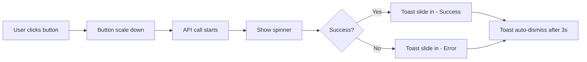

# [Project Name] Animation Specifications

**Version:** 1.0
**Last Updated:** [Date]
**Created By:** Pixel-Perfect Designer Agent

---

## Overview

This document defines all micro-interactions and animations for the [Project Name] design system. Animations should feel smooth, purposeful, and enhance the user experience without being distracting.

**Animation Principles:**
- **Purposeful:** Every animation serves a functional purpose (feedback, guidance, delight)
- **Consistent:** Similar interactions use similar animation patterns
- **Performant:** Animations are optimized for 60fps on target devices
- **Accessible:** Respect `prefers-reduced-motion` user settings

---

## Global Animation Settings

### Timing Functions
```css
--ease-in: cubic-bezier(0.4, 0, 1, 1);
--ease-out: cubic-bezier(0, 0, 0.2, 1);
--ease-in-out: cubic-bezier(0.4, 0, 0.2, 1);
--bounce: cubic-bezier(0.68, -0.55, 0.265, 1.55);
```

### Durations
```css
--duration-instant: 50ms;   /* Near-instant feedback */
--duration-fast: 150ms;     /* Quick transitions */
--duration-normal: 250ms;   /* Standard animations */
--duration-slow: 350ms;     /* Deliberate, emphasized */
--duration-slower: 500ms;   /* Complex sequences */
```

### Implementation Library
**Recommended:** Framer Motion (React), CSS Transitions (vanilla), or platform-specific (iOS UIKit animations)

---

## Button Animations

### Primary Button Hover
**Element:** `.btn-primary`

**Keyframes:**
- **Start:**
  - `background: var(--color-primary)`
  - `box-shadow: var(--shadow-sm)`
  - `transform: scale(1)`
- **End:**
  - `background: var(--color-primary-dark)`
  - `box-shadow: var(--shadow-md)`
  - `transform: scale(1.02)`

**Trigger:** Mouse hover / Touch press
**Duration:** `var(--duration-fast)` (150ms)
**Easing:** `var(--ease-out)`

**Code Example (CSS):**
```css
.btn-primary {
  transition: background-color 150ms ease-out,
              box-shadow 150ms ease-out,
              transform 150ms ease-out;
}

.btn-primary:hover {
  background: var(--color-primary-dark);
  box-shadow: var(--shadow-md);
  transform: scale(1.02);
}
```

---

### Primary Button Click
**Element:** `.btn-primary`

**Keyframes:**
- **Click:** `transform: scale(0.98)`
- **Release:** `transform: scale(1)`

**Trigger:** Mouse click / Touch tap
**Duration:** `var(--duration-instant)` (50ms)
**Easing:** `var(--ease-in-out)`

**Code Example (CSS):**
```css
.btn-primary:active {
  transform: scale(0.98);
  transition: transform 50ms ease-in-out;
}
```

---

## Card Animations

### Card Hover Elevation
**Element:** `.card`

**Keyframes:**
- **Start:**
  - `box-shadow: var(--shadow-md)`
  - `transform: translateY(0)`
- **End:**
  - `box-shadow: var(--shadow-lg)`
  - `transform: translateY(-4px)`

**Trigger:** Mouse hover
**Duration:** `var(--duration-normal)` (250ms)
**Easing:** `var(--ease-out)`

**Code Example (CSS):**
```css
.card {
  transition: box-shadow 250ms ease-out,
              transform 250ms ease-out;
}

.card:hover {
  box-shadow: var(--shadow-lg);
  transform: translateY(-4px);
}
```

---

### Card Enter (Page Load)
**Element:** `.card`

**Keyframes:**
- **0%:**
  - `opacity: 0`
  - `transform: translateY(20px)`
- **100%:**
  - `opacity: 1`
  - `transform: translateY(0)`

**Trigger:** Element enters viewport / Page load
**Duration:** `var(--duration-slow)` (350ms)
**Easing:** `var(--ease-out)`
**Stagger:** 50ms between each card (if multiple)

**Code Example (Framer Motion):**
```jsx
<motion.div
  className="card"
  initial={{ opacity: 0, y: 20 }}
  animate={{ opacity: 1, y: 0 }}
  transition={{ duration: 0.35, ease: "easeOut" }}
>
  {/* Card content */}
</motion.div>
```

---

## Form Input Animations

### Input Focus
**Element:** `.input`

**Keyframes:**
- **Start:**
  - `border-color: var(--color-gray-300)`
  - `box-shadow: none`
- **Focus:**
  - `border-color: var(--color-primary)`
  - `box-shadow: 0 0 0 3px rgba([PRIMARY_RGB], 0.1)`

**Trigger:** Input focus
**Duration:** `var(--duration-fast)` (150ms)
**Easing:** `var(--ease-out)`

**Code Example (CSS):**
```css
.input {
  transition: border-color 150ms ease-out,
              box-shadow 150ms ease-out;
}

.input:focus {
  border-color: var(--color-primary);
  box-shadow: 0 0 0 3px rgba(59, 130, 246, 0.1);
}
```

---

### Label Float (Material Design Style)
**Element:** `.input-label`

**Keyframes:**
- **Empty/Unfocused:**
  - `transform: translateY(12px)`
  - `font-size: var(--text-base)`
  - `color: var(--color-gray-500)`
- **Filled/Focused:**
  - `transform: translateY(-8px)`
  - `font-size: var(--text-xs)`
  - `color: var(--color-primary)`

**Trigger:** Input focus or has value
**Duration:** `var(--duration-fast)` (150ms)
**Easing:** `var(--ease-out)`

---

## Modal Animations

### Modal Backdrop Fade In
**Element:** `.modal-backdrop`

**Keyframes:**
- **0%:** `opacity: 0`
- **100%:** `opacity: 1` (typically 0.5-0.8 for overlay)

**Trigger:** Modal open
**Duration:** `var(--duration-normal)` (250ms)
**Easing:** `var(--ease-out)`

---

### Modal Content Slide & Fade
**Element:** `.modal-content`

**Keyframes:**
- **0%:**
  - `opacity: 0`
  - `transform: translateY(40px) scale(0.95)`
- **100%:**
  - `opacity: 1`
  - `transform: translateY(0) scale(1)`

**Trigger:** Modal open
**Duration:** `var(--duration-slow)` (350ms)
**Easing:** `var(--ease-out)`

**Code Example (Framer Motion):**
```jsx
<motion.div
  className="modal-content"
  initial={{ opacity: 0, y: 40, scale: 0.95 }}
  animate={{ opacity: 1, y: 0, scale: 1 }}
  exit={{ opacity: 0, y: 20, scale: 0.95 }}
  transition={{ duration: 0.35, ease: "easeOut" }}
>
  {/* Modal content */}
</motion.div>
```

---

## Navigation Animations

### Sidebar Slide In
**Element:** `.sidebar`

**Keyframes:**
- **Closed:** `transform: translateX(-100%)`
- **Open:** `transform: translateX(0)`

**Trigger:** Hamburger menu click
**Duration:** `var(--duration-slow)` (350ms)
**Easing:** `var(--ease-out)`

**Additional Effect:**
- Main content shifts right or dims with overlay

---

### Tab Switch
**Element:** `.tab-content`

**Keyframes:**
- **Exit:**
  - `opacity: 1` → `opacity: 0`
  - `transform: translateX(0)` → `transform: translateX(-20px)`
- **Enter:**
  - `opacity: 0` → `opacity: 1`
  - `transform: translateX(20px)` → `transform: translateX(0)`

**Trigger:** Tab click
**Duration:** `var(--duration-fast)` (150ms per phase, 300ms total)
**Easing:** `var(--ease-in-out)`

---

## Loading States

### Spinner Rotation
**Element:** `.spinner`

**Keyframes:**
- **0%:** `transform: rotate(0deg)`
- **100%:** `transform: rotate(360deg)`

**Trigger:** Content loading
**Duration:** `1000ms` (continuous loop)
**Easing:** `linear`

**Code Example (CSS):**
```css
@keyframes spin {
  from { transform: rotate(0deg); }
  to { transform: rotate(360deg); }
}

.spinner {
  animation: spin 1s linear infinite;
}
```

---

### Skeleton Shimmer
**Element:** `.skeleton`

**Keyframes:**
- **Background gradient moves left to right**
- `background-position: -200% 0` → `200% 0`

**Trigger:** Content loading
**Duration:** `1500ms` (continuous loop)
**Easing:** `ease-in-out`

**Code Example (CSS):**
```css
@keyframes shimmer {
  0% { background-position: -200% 0; }
  100% { background-position: 200% 0; }
}

.skeleton {
  background: linear-gradient(
    90deg,
    var(--color-gray-200) 25%,
    var(--color-gray-100) 50%,
    var(--color-gray-200) 75%
  );
  background-size: 200% 100%;
  animation: shimmer 1.5s ease-in-out infinite;
}
```

---

## Notification/Toast Animations

### Toast Slide In (from top)
**Element:** `.toast`

**Keyframes:**
- **0%:**
  - `opacity: 0`
  - `transform: translateY(-100%)`
- **100%:**
  - `opacity: 1`
  - `transform: translateY(0)`

**Trigger:** Notification triggered
**Duration:** `var(--duration-slow)` (350ms)
**Easing:** `var(--bounce)` (slight overshoot)

**Auto-dismiss:** After 3-5 seconds, reverse animation

---

## List/Grid Item Animations

### Staggered List Enter
**Element:** `.list-item`

**Keyframes:**
- **0%:**
  - `opacity: 0`
  - `transform: translateX(-20px)`
- **100%:**
  - `opacity: 1`
  - `transform: translateX(0)`

**Trigger:** Page load / Filter change
**Duration:** `var(--duration-normal)` (250ms per item)
**Easing:** `var(--ease-out)`
**Stagger:** 50ms between each item

**Code Example (Framer Motion):**
```jsx
{items.map((item, index) => (
  <motion.div
    key={item.id}
    className="list-item"
    initial={{ opacity: 0, x: -20 }}
    animate={{ opacity: 1, x: 0 }}
    transition={{
      duration: 0.25,
      delay: index * 0.05,
      ease: "easeOut"
    }}
  >
    {item.content}
  </motion.div>
))}
```

---

## Micro-Interactions

### Checkbox Check Animation
**Element:** `.checkbox`

**Keyframes:**
- **Checkmark draws in** using SVG path animation
- `stroke-dashoffset: 100` → `0`

**Trigger:** Checkbox checked
**Duration:** `var(--duration-normal)` (250ms)
**Easing:** `var(--ease-out)`

---

### Toggle Switch
**Element:** `.toggle-switch`

**Keyframes:**
- **Knob position:** `transform: translateX(0)` → `translateX(20px)`
- **Background color:** `var(--color-gray-300)` → `var(--color-primary)`

**Trigger:** Toggle click
**Duration:** `var(--duration-fast)` (150ms)
**Easing:** `var(--ease-in-out)`

---

### Like/Favorite Heart
**Element:** `.heart-icon`

**Keyframes:**
- **0%:**
  - `transform: scale(1)`
  - `color: var(--color-gray-400)`
- **50%:**
  - `transform: scale(1.3)`
- **100%:**
  - `transform: scale(1)`
  - `color: var(--color-error)` (red)

**Trigger:** Heart icon click
**Duration:** `var(--duration-normal)` (250ms)
**Easing:** `var(--bounce)`

---

## Accessibility Considerations

### Reduced Motion
**Respect user preferences:**

```css
@media (prefers-reduced-motion: reduce) {
  * {
    animation-duration: 0.01ms !important;
    animation-iteration-count: 1 !important;
    transition-duration: 0.01ms !important;
  }
}
```

**Alternative for reduced motion:**
- Remove transform/scale animations
- Keep opacity fades (less jarring)
- Instant state changes for critical UI

---

## Performance Guidelines

### Optimize for 60fps
- **Animate:** `transform`, `opacity` (GPU-accelerated)
- **Avoid animating:** `width`, `height`, `margin`, `padding` (triggers layout reflow)

### Use `will-change` Sparingly
```css
.card:hover {
  will-change: transform, box-shadow;
}
```

### Hardware Acceleration
```css
.animated-element {
  transform: translateZ(0); /* Force GPU acceleration */
}
```

---

## Implementation Checklist

- [ ] All animations respect `prefers-reduced-motion`
- [ ] Animations run at 60fps on target devices
- [ ] Timing and easing are consistent with design system
- [ ] Stagger delays are consistent across similar UI patterns
- [ ] Loading states provide feedback within 100ms
- [ ] Animations enhance UX without causing distraction
- [ ] Complex animations are documented with code examples

---

## User Flow Diagrams (Optional)

**For complex interactions, include Mermaid charts:**



---

## Version Control

**v1.0** - [Date] - Initial animation specifications created
[Add subsequent versions here with change notes]

---

**Generated by:** Pixel-Perfect Designer Agent
**Framework:** Flow Engineering Methodology - Step 3 (Animation Design)
**Contact:** [Project owner contact if applicable]
