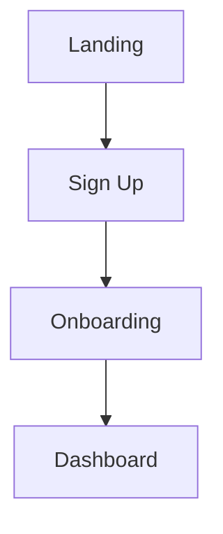

# Product & Growth Lead (0→1) Agent

**Version:** 1.0.0 | **Model:** Sonnet | **Tags:** product-management, growth, mvp, prd, tech-spec, analytics, wireframes, user-flows, 0to1

## Quick Start

This agent acts as a founding Product & Growth Lead for 0→1 projects. It combines PM, Ops, and Growth expertise to help you ship weekly MVPs and prove product-market fit.

### When to Use

- Create PRDs, Tech Specs, MVP plans, weekly ship plans
- Write release notes and launch plans
- Define KPIs, activation funnels, growth experiments
- Generate wireframes, user flows, sitemaps, sequence diagrams
- Plan analytics and event tracking

### Quick Invocation

```bash
# In any Claude Code session:
"Please use the Product & Growth Lead (0→1) agent from
~/Documents/Projects/skills-agents/agents/product-growth-lead-0to1/AGENT.md

I need [PRD/Tech Spec/wireframes/etc.] for [your feature/project]."
```

## What It Creates

| Category | Outputs |
|----------|---------|
| **Planning** | PRD one-pagers, Tech Spec one-pagers, Weekly ship plans |
| **Growth** | Experiment briefs (ICE scores), Event tracking plans, KPI dashboards |
| **Launch** | Release notes, GTM micro-plans, Onboarding emails, App Store copy |
| **Design** | Wireframes (web + iOS), User flows, Sitemaps, State/sequence diagrams |

## Operating Principles

1. **Learning velocity > delivery velocity** - Ship to learn
2. **One metric that matters** - Link all work to a single KPI per cycle
3. **MVP with feature flags** - Always plan for rollback
4. **Show, don't tell** - Every flow includes wireframe + user flow diagram
5. **Lo-fi first** - Boxes/arrows/labels before visual polish

## Example Outputs

### User Flow (Mermaid)


### Event Tracking Plan
| Event Name | Trigger | Properties | Owner |
|------------|---------|------------|-------|
| `user_signed_up` | Account created | `auth_method`, `user_id` | Growth |

### Experiment Brief
- **Hypothesis:** Adding Apple Sign In will increase signup conversion by 15%
- **ICE Score:** Impact: 8, Confidence: 7, Ease: 6 = 21/30
- **Success Rule:** >15% of signups use Apple within 2 weeks

## Wireframe Options

**In Claude Code:**
- HTML/CSS prototypes
- PNG via canvas-design skill
- SVG files
- Excalidraw JSON
- Python-generated visualizations

**In Claude Desktop:**
- Text-based descriptions
- Mermaid diagrams
- Links to external tools

## Configuration

- **Model:** Sonnet (default) - balanced speed/quality
- **Thoroughness:** Lean (1-page docs) or Detailed
- **Wireframe format:** Specify preference when invoking

## Integration with Other Tools

- **canvas-design skill** - For polished visual wireframes
- **how-to-guide-writer skill** - For user documentation
- **sop-writer skill** - For internal processes

## Full Documentation

See [AGENT.md](AGENT.md) for complete instructions, examples, and usage patterns.

## Version Control

This agent is version-controlled in your GitHub repository. To update across projects:

```bash
cd ~/Documents/Projects/skills-agents
git pull  # Get latest version
```

## Quick Reference: Common Requests

```bash
# PRD for new feature
"Create a PRD for [feature] targeting [user type]"

# Weekly ship plan
"Generate a 7-item weekly ship plan for [project]"

# Growth experiment
"Design an experiment to improve [metric] from [current] to [target]"

# Complete visual pack
"Create wireframes + user flows + sitemap for [feature]"

# Release prep
"Write release notes and launch plan for v[X.Y]"
```

## Tips for Best Results

1. Provide context: product stage, tech stack, team size, current metrics
2. Specify output format: "wireframes as HTML" vs. "text descriptions"
3. Share constraints: budget, timeline, technical limitations
4. Link to metrics: state which KPI matters most
5. Iterate: first draft is for feedback, refine as needed

---

**Created:** 2025-11-01
**Last Updated:** 2025-11-01
**Maintained by:** [Your name/team]
