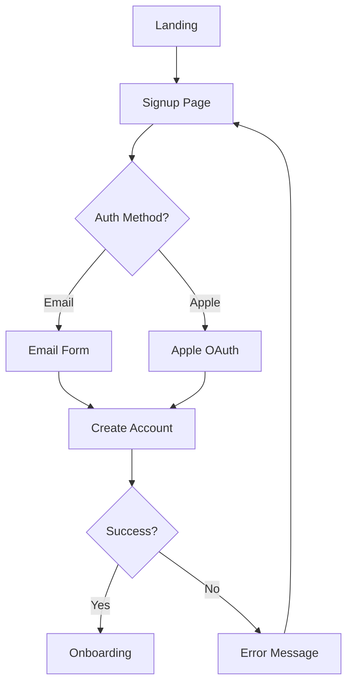
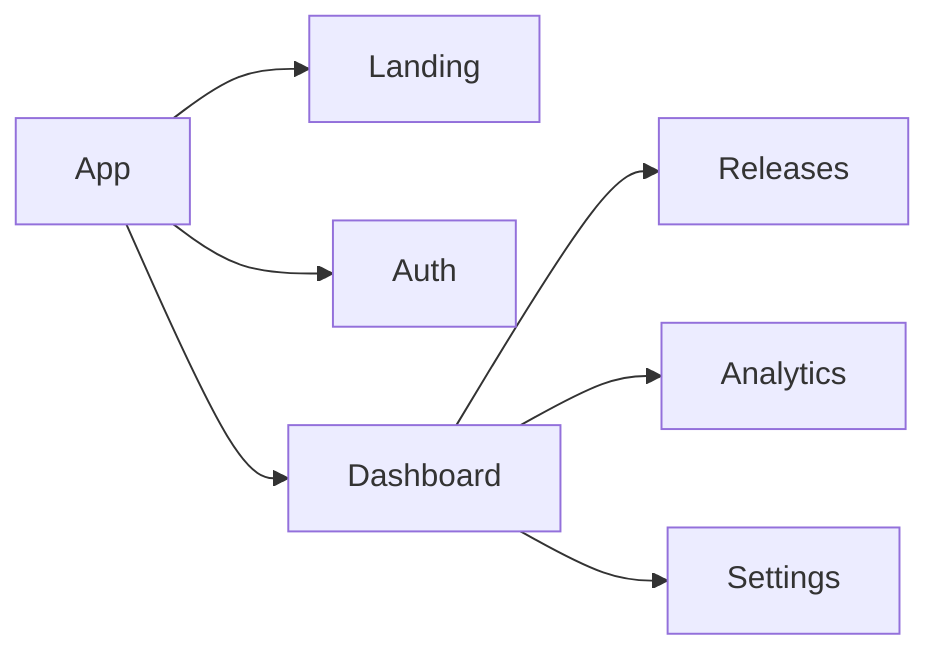
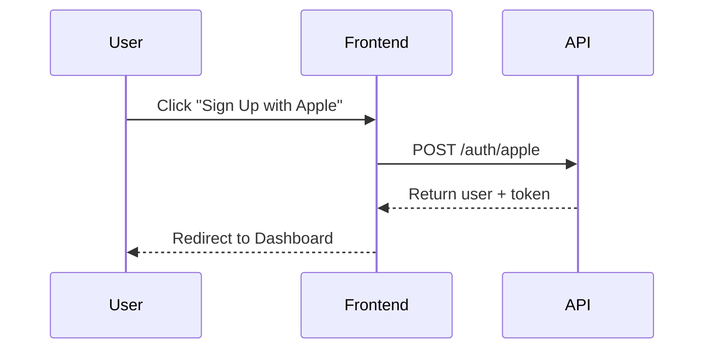

# Wireframe Checklist

**Feature:** [Feature Name]
**Date:** [YYYY-MM-DD]
**Designer:** [Name]
**Status:** [In Progress / Review / Approved]

---

## Purpose

Use this checklist to ensure your wireframes are complete before handoff to engineering. Wireframes should show the structure, layout, and interaction patterns—NOT final visual design.

**Remember:** Lo-fi first. Prioritize boxes, arrows, and labels over visual polish.

---

## Wireframe Deliverables

### Required for All P0 Flows

- [ ] **User flow diagram** (Mermaid or Figma)
  - Shows all decision points
  - Includes error states
  - Maps to wireframe screens

- [ ] **Wireframes for each screen in the flow**
  - Desktop/Web version (if applicable)
  - Mobile/iOS version (if applicable)
  - Tablet version (if different from mobile/desktop)

- [ ] **Interaction annotations**
  - What happens when user clicks/taps each element
  - Validation rules (e.g., "Email must be valid format")
  - Loading states (e.g., "Show spinner while authenticating")

---

## Per-Screen Wireframe Checklist

For each screen, include:

### Layout & Structure

- [ ] **Navigation**
  - Header (if applicable): Logo, menu, user profile
  - Footer (if applicable): Links, legal, contact
  - Back button or breadcrumbs (if needed)

- [ ] **Content hierarchy**
  - Clear visual hierarchy (headings, subheadings, body text)
  - Scannable layout (use of whitespace, grouping)

- [ ] **Grid alignment**
  - Elements align to a grid (even if lo-fi)
  - Consistent spacing/padding

### Interactive Elements

- [ ] **Buttons**
  - Primary action clearly identified (e.g., "Sign Up", "Submit")
  - Secondary actions differentiated (e.g., "Cancel", "Back")
  - Disabled states shown (if applicable)
  - Loading states shown (if applicable)

- [ ] **Form fields**
  - Labels for each field
  - Placeholder text (optional)
  - Required vs. optional indicators
  - Input types specified (text, email, password, date, etc.)
  - Validation messages (inline or below field)

- [ ] **Links**
  - Clearly differentiated from buttons
  - Indicate external links (if applicable)

- [ ] **Icons**
  - Named or described (e.g., "Icon: magnifying glass for search")
  - Accessible alternative text noted

### States & Feedback

- [ ] **Empty states**
  - What shows when there's no data? (e.g., "No releases yet")
  - Call-to-action to populate (e.g., "Create your first release")

- [ ] **Loading states**
  - Skeleton screens, spinners, or progress indicators
  - What happens during async operations?

- [ ] **Error states**
  - Form validation errors
  - Network/API errors
  - 404 or "not found" states

- [ ] **Success states**
  - Confirmation messages (e.g., "Account created!")
  - Toast notifications or modals

### Content & Copy

- [ ] **Headings**
  - Page title or main heading present
  - Hierarchy clear (H1 → H2 → H3)

- [ ] **Body text**
  - Placeholder copy or realistic example text
  - Length representative of actual content

- [ ] **CTAs (Calls to Action)**
  - Button text is action-oriented (e.g., "Get Started", not just "Submit")
  - Clear what happens next

- [ ] **Help text**
  - Tooltips, hints, or explainers where needed
  - Error message copy (even if placeholder)

### Responsive Design

- [ ] **Mobile wireframe**
  - Optimized for small screens (320px - 428px wide)
  - Touch targets are large enough (min 44x44px)
  - No horizontal scrolling

- [ ] **Tablet wireframe** (if different from mobile/desktop)
  - Utilizes extra screen space appropriately

- [ ] **Desktop wireframe**
  - Optimized for large screens (1280px+ wide)
  - Content doesn't stretch awkwardly

### Accessibility

- [ ] **Keyboard navigation**
  - Tab order makes sense
  - Focus states indicated

- [ ] **Screen reader support**
  - Alt text for images/icons noted
  - Form labels properly associated

- [ ] **Color contrast**
  - Even in lo-fi, avoid low-contrast text (note if important)

- [ ] **Focus states**
  - Visible indicator when element is focused

---

## Additional Artifacts

### User Flow Diagram

- [ ] **Mermaid or Figma flowchart**
  - Start → End clearly marked
  - Decision points (yes/no branches)
  - Error paths included

**Example:**


### Sitemap / IA

- [ ] **Information architecture diagram**
  - Shows all pages/screens
  - Parent-child relationships
  - Navigation paths

**Example:**


### State or Sequence Diagram (for complex interactions)

- [ ] **Sequence diagram** (if multi-step process)
  - Shows user ↔ frontend ↔ backend interactions
  - Timing of events
  - Error handling

**Example:**


---

## Handoff Checklist

Before sending to engineering:

### Deliverables Ready

- [ ] All wireframes exported (PNG, PDF, or Figma link)
- [ ] User flow diagram included
- [ ] Sitemap/IA included (if applicable)
- [ ] Annotations document or inline comments

### Documentation

- [ ] **Interaction notes**
  - What happens on click/tap for each interactive element
  - Validation rules
  - API calls needed (if known)

- [ ] **Content requirements**
  - Where does content come from? (user input, API, hardcoded)
  - Character limits for text fields
  - Image dimensions and formats

- [ ] **Edge cases addressed**
  - What if there's too much text?
  - What if an image fails to load?
  - What if the user has no data yet?

### Cross-functional Review

- [ ] **Product review**
  - Wireframes match PRD requirements
  - All P0 features covered

- [ ] **Design review**
  - Layout makes sense
  - Patterns consistent with design system (if one exists)

- [ ] **Engineering review**
  - Feasibility confirmed
  - Open questions answered (e.g., API availability)

---

## Example Wireframe (Text-Based)

```
┌─────────────────────────────────────────┐
│  [Logo]  Home  Features  Pricing  Login │  ← Header
├─────────────────────────────────────────┤
│                                         │
│   Ship faster. Learn faster.            │  ← Hero heading
│                                         │
│   Track every release and see           │  ← Subheading
│   what moves your KPIs.                 │
│                                         │
│   [Get Started Free]  [View Demo]       │  ← CTAs
│                                         │
├─────────────────────────────────────────┤
│   How it works                          │  ← Section heading
│                                         │
│   ┌─────┐  ┌─────┐  ┌─────┐            │
│   │  1  │  │  2  │  │  3  │            │  ← Feature cards
│   │Ship │  │Track│  │Learn│            │
│   └─────┘  └─────┘  └─────┘            │
│                                         │
├─────────────────────────────────────────┤
│  © 2025  Privacy  Terms  Contact        │  ← Footer
└─────────────────────────────────────────┘
```

**Interaction notes:**
- "Get Started Free" → Signup page
- "View Demo" → Demo video modal
- Feature cards → Scroll to detail sections

---

## Wireframe Formats

### Option 1: Text-Based (Fastest)
- ASCII art or structured markdown
- Good for simple layouts
- Easy to iterate quickly

### Option 2: HTML/CSS (Claude Code)
- Actual HTML file with basic CSS
- Clickable prototype
- Can test responsiveness

### Option 3: PNG via canvas-design skill
- Visual wireframe as PNG
- Good for presentations
- Requires more time

### Option 4: Excalidraw or Figma
- Link to external tool
- Collaborative editing
- Requires external tool setup

**Default recommendation:** Start with text-based or Mermaid diagrams, then upgrade to HTML/PNG if needed.

---

## Common Pitfalls to Avoid

- [ ] **Too much detail too soon**
  - ❌ Don't worry about exact colors, fonts, imagery yet
  - ✅ Focus on layout, hierarchy, interaction patterns

- [ ] **Missing error states**
  - ❌ Only showing the "happy path"
  - ✅ Include what happens when things go wrong

- [ ] **Unclear CTAs**
  - ❌ Button says "Submit" with no context
  - ✅ Button says "Create Account" or "Sign Up"

- [ ] **Inconsistent patterns**
  - ❌ Buttons look different across screens
  - ✅ Use consistent button styles, spacing, patterns

- [ ] **No mobile version**
  - ❌ Only desktop wireframe provided
  - ✅ Mobile wireframe for all P0 flows

---

## Sign-off

- [ ] Designer: [Name] - [Date]
- [ ] Product Lead: [Name] - [Date]
- [ ] Engineering Lead: [Name] - [Date]

---

**Notes:**
- This is a living checklist. Update as you learn what works for your team.
- Not every item applies to every project. Use judgment.
- When in doubt, communicate more, not less.
