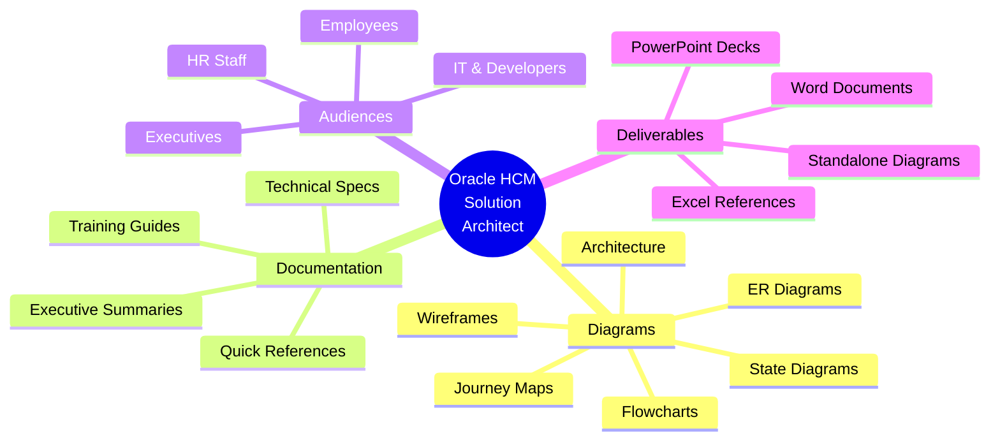

# 🚀 Oracle HCM Solution Architect Skill
## Your AI-Powered Oracle Documentation & Diagramming Partner

**Transform complex Oracle HCM processes into crystal-clear visual documentation in minutes, not days.**

---

## 💡 The Challenge You Face Daily

- 📋 Oracle processes are complex and hard to explain
- 👥 Different audiences need different levels of detail
- ⏰ Creating diagrams manually takes hours
- 📚 Documentation gets outdated quickly
- 🎨 Customizations are hard to track and communicate
- 🔄 Every change requires updating multiple documents

## ✨ The Solution: AI-Powered Oracle Expertise

This skill combines **Oracle HCM/Recruiting Cloud expertise** with **instant diagram generation** to create professional documentation tailored to any audience—technical, HR staff, employees, or executives.

**One request. Multiple formats. Minutes, not days.**

---

## 🎯 What This Skill Can Do For You



---

## 📊 7 Powerful Diagram Types (All Automated)

### 1. 🔄 Flowcharts - Process Workflows

**Perfect for**: Approval chains, business processes, decision flows

**Examples**:
- Requisition approval workflows (with customizations highlighted!)
- Employee action processes (hire, transfer, promotion, termination)
- Time-off request approvals
- Benefits enrollment processes
- Performance review cycles

**What you get**:
- Color-coded decision points
- Error paths and happy paths
- Customizations highlighted in yellow
- Role-based annotations
- Legend and context

**Real use case**: *"Document our custom requisition approval with budget check"*
→ Flowchart showing standard Oracle vs. your custom process, side-by-side

---

### 2. 🗺️ Journey Maps - User Experience

**Perfect for**: Understanding emotional touchpoints, improving UX

**Examples**:
- Candidate experience (application → hire)
- Employee onboarding journey
- Manager approval experience
- Benefits open enrollment journey
- Performance review process from employee perspective

**What you get**:
- Emotional satisfaction scores at each step
- Pain points and delight moments
- Multi-actor interactions
- Timeline visualization
- Opportunities for improvement

**Real use case**: *"Show me what candidates experience in our hiring process"*
→ Journey map revealing where candidates feel frustrated or excited

---

### 3. 🏗️ Architecture Diagrams - System Overview

**Perfect for**: Integration planning, technical documentation, CIO briefings

**Examples**:
- Oracle HCM integration landscape
- Data flow between systems
- Security architecture
- API architecture
- Cloud infrastructure layout

**What you get**:
- System components and connections
- Data flow directions
- Integration methods (REST, HDL, Extract)
- External systems highlighted
- Security boundaries

**Real use case**: *"Explain our Oracle integration architecture to the CIO"*
→ Executive-level diagram showing Oracle + Payroll + Benefits + Time systems

---

### 4. 📐 Wireframes - UI/UX Design

**Perfect for**: Planning page layouts, designing employee portals

**Examples**:
- Oracle Redwood page layouts
- Employee self-service portal mockups
- Manager dashboard designs
- Mobile app views
- Custom page composer layouts

**What you get**:
- Desktop, tablet, and mobile views
- Component placement (cards, tiles, buttons)
- Navigation flows
- Role-based views
- Redwood design compliance

**Real use case**: *"Wireframe our new employee portal homepage"*
→ Mockup showing card layout, navigation, personalized content

---

### 5. 🔗 ER Diagrams - Data Models

**Perfect for**: Understanding data relationships, integration planning

**Examples**:
- Person-Employment-Assignment structure
- Recruiting data model (Requisition-Candidate-Application)
- Benefits enrollment data
- Security role hierarchy
- Custom flexfield structures

**What you get**:
- Table relationships (1:1, 1:many, many:many)
- Primary and foreign keys
- Field definitions
- Oracle-specific entities
- Integration points

**Real use case**: *"Show how person, employment, and assignment relate in Oracle"*
→ ER diagram clarifying Oracle's core HR data structure

---

### 6. ⚡ Sequence Diagrams - System Interactions

**Perfect for**: API documentation, troubleshooting integrations

**Examples**:
- API call sequences
- Integration flows (Oracle ↔ External system)
- Authentication flows
- Batch processing sequences
- Real-time data sync

**What you get**:
- Time-sequenced interactions
- Request/response flows
- Error handling
- Timing considerations
- Technical details

**Real use case**: *"Document how our payroll integration works"*
→ Sequence diagram showing Oracle → Integration Cloud → Payroll system with timing

---

### 7. 🎭 State Diagrams - Status Lifecycles

**Perfect for**: Understanding status progressions, troubleshooting

**Examples**:
- Requisition status flow (Draft → Active → Filled → Closed)
- Candidate status progression
- Employee work status changes
- Absence request states
- Performance review states

**What you get**:
- All possible statuses
- Valid transitions
- Automatic vs. manual transitions
- Error states
- End states

**Real use case**: *"What statuses can a requisition have?"*
→ State diagram showing all possible requisition statuses and how they change

---

## 👥 Tailored for Every Audience

### 🖥️ For IT & Developers (Technical)

**What you get**:
- ✅ API endpoints and methods
- ✅ Error handling and edge cases
- ✅ Oracle configuration specifics
- ✅ Security implementation details
- ✅ Integration patterns (REST, HDL, Extract)
- ✅ References to Oracle documentation

**Tone**: Technical, detailed, precise

**Example**: *"Create technical spec for our HireRight integration"*
→ Sequence diagram with API endpoints, authentication, error codes, retry logic

---

### 👔 For HR Staff (Semi-Technical)

**What you get**:
- ✅ Step-by-step instructions
- ✅ Simple language (no jargon)
- ✅ Screenshots and visual aids
- ✅ Tips and best practices
- ✅ Troubleshooting guides
- ✅ Common scenarios

**Tone**: Clear, instructional, helpful

**Example**: *"Create training guide for HR on processing resignations"*
→ Simple flowchart + step-by-step instructions + FAQ

---

### 👤 For Employees (Non-Technical)

**What you get**:
- ✅ Very simple language
- ✅ Visual, icon-rich
- ✅ Quick reference format
- ✅ Mobile-friendly layout
- ✅ "What's in it for me" focus
- ✅ Minimal text, maximum clarity

**Tone**: Friendly, concise, approachable

**Example**: *"Show employees how to request time off"*
→ 3-step visual guide with icons and simple language

---

### 💼 For Executives (Leadership)

**What you get**:
- ✅ High-level only (1-2 pages max)
- ✅ Business value and ROI focus
- ✅ Metrics and KPIs
- ✅ Risk assessment
- ✅ Timeline and costs
- ✅ Clear recommendation

**Tone**: Strategic, concise, business-focused

**Example**: *"Present Oracle Recruiting Cloud benefits to CFO"*
→ One-page executive summary with ROI, timeline, investment

---

## 🎨 Customization Documentation (Our Superpower!)

### The Problem
When you customize Oracle, it's critical to document:
- ✋ What's standard Oracle vs. what's custom
- 🔍 Why the customization was needed
- 🛠️ How to maintain it during upgrades
- 📋 Testing and rollback procedures

### Our Solution: Visual Comparison

**Every customization gets**:
1. **Before diagram**: Standard Oracle process (blue)
2. **After diagram**: Your custom process (custom elements in yellow)
3. **Impact analysis**: Upgrade implications, maintenance needs
4. **Test scenarios**: How to validate it works
5. **Rollback plan**: How to undo if needed

**Customization Types We Document**:
- 🔧 Flexfields (DFF/EFF)
- 🔄 BPM custom workflows
- 📄 Page layouts and Page Composer
- 🧮 Fast Formulas
- 📊 Custom OTBI/BIP reports
- 🔌 REST API integrations

**Example**: *"Document our custom budget check that's not in standard Oracle"*

**You get**:
```
Diagram 1: Standard Oracle Requisition Approval
  Manager → HR → Post

Diagram 2: Your Custom Requisition Approval
  Manager → HR → 🟡 Budget Check (Custom) → CFO (if needed) → Post

Impact Analysis:
  - Oracle updates: Must test budget check after each quarterly update
  - Maintenance: Budget service must remain available
  - Rollback: Can disable via configuration flag
```

---

## 📦 Complete Deliverable Packages

### 📄 Documentation Package (with docx skill)

**What you get**:
- Professional Word document
- Embedded Mermaid diagrams
- Narrative explanations
- Table of contents
- Glossary of Oracle terms
- FAQ section
- Formatted for Creighton branding

**Use cases**:
- Process documentation
- Technical specifications
- Training manuals
- User quick reference guides

---

### 📊 Presentation Package (with pptx skill)

**What you get**:
- PowerPoint presentation
- One diagram per slide
- Speaker notes for each slide
- Executive summary slide
- Creighton University template
- Ready to present

**Use cases**:
- Executive briefings
- Design reviews
- Training decks
- Project status updates

---

### 📈 Data Package (with xlsx skill)

**What you get**:
- Excel spreadsheet
- Field mapping tables
- Configuration worksheets
- Test scenario matrices
- Role permission grids
- Formatted for readability

**Use cases**:
- Integration specifications
- Configuration references
- Testing documentation
- Security matrices

---

## 🏆 Real-World Use Cases

### Use Case 1: New HR Analyst Training

**Request**: *"Create training materials for new HR analysts on how to process a resignation"*

**What you get in 5 minutes**:
1. ✅ Simple resignation flowchart (for learning)
2. ✅ Step-by-step guide with screenshots
3. ✅ Common scenarios and troubleshooting
4. ✅ FAQ section
5. ✅ Quick reference card (1-page)

**Alternative**: Spend 8 hours creating this manually

---

### Use Case 2: Executive Approval for Oracle Recruiting Cloud

**Request**: *"Create presentation for CFO on why we should implement Oracle Recruiting Cloud"*

**What you get in 10 minutes**:
1. ✅ Current state: Manual recruiting process flowchart
2. ✅ Future state: Oracle Recruiting Cloud workflow
3. ✅ ROI analysis (time saved, improved experience)
4. ✅ Integration architecture diagram
5. ✅ Timeline and investment summary
6. ✅ PowerPoint deck with speaker notes

**Alternative**: Spend 2 days researching and creating slides

---

### Use Case 3: Integration Development

**Request**: *"Document how our Equifax I-9 integration should work for developers"*

**What you get in 15 minutes**:
1. ✅ Architecture diagram (Oracle HCM ↔ Equifax)
2. ✅ Sequence diagram with API calls
3. ✅ Data mapping table (what fields to send/receive)
4. ✅ Error handling specifications
5. ✅ Security requirements
6. ✅ Test scenarios

**Alternative**: Spend a full day writing technical specs

---

### Use Case 4: Process Improvement Project

**Request**: *"Map our current onboarding journey and identify pain points"*

**What you get in 20 minutes**:
1. ✅ Current state journey map (with satisfaction scores)
2. ✅ Pain point analysis (where candidates struggle)
3. ✅ Bottleneck identification
4. ✅ Future state journey map (optimized)
5. ✅ Process flowchart with recommended changes
6. ✅ ROI of improvements

**Alternative**: Weeks of user research and documentation

---

### Use Case 5: Customization Documentation for Upgrades

**Request**: *"Document all our Oracle customizations before the quarterly update"*

**What you get in 30 minutes**:
1. ✅ Complete inventory of customizations
2. ✅ Standard vs. custom comparison diagrams
3. ✅ Impact analysis for each customization
4. ✅ Testing plan for post-upgrade validation
5. ✅ Risk assessment
6. ✅ Rollback procedures

**Alternative**: Scramble to remember what's custom during upgrade (disaster!)

---

## 🎓 Oracle Domain Expertise Built-In

You don't need to be an Oracle expert. The skill knows:

### Oracle HCM Cloud Modules
- ✅ **Global HR**: Person, employment, assignment management
- ✅ **Recruiting Cloud**: Requisition to hire process
- ✅ **Talent Management**: Performance, goals, succession, learning
- ✅ **Workforce Management**: Time, labor, absence
- ✅ **Payroll**: US and international payroll
- ✅ **Benefits**: Enrollment and administration
- ✅ **Compensation**: Merit increases, bonuses, equity

### Oracle Recruiting Cloud Processes
- ✅ Requisition Management (Create → Approve → Post → Close)
- ✅ Candidate Pipeline (Apply → Screen → Interview → Offer → Hire)
- ✅ Job Posting (Internal career site + external job boards)
- ✅ Offer Management (Generate → Negotiate → Accept → Onboard)
- ✅ Recruiting Analytics (Time to fill, source effectiveness, metrics)

### Oracle Redwood Design System
- ✅ Modern, mobile-first UI framework
- ✅ Component-based architecture (cards, tiles, lists)
- ✅ Responsive design (desktop, tablet, mobile)
- ✅ Accessibility compliant (WCAG 2.1 AA)
- ✅ Progressive disclosure patterns
- ✅ Role-based personalization

### Common Customizations
- ✅ **Flexfields (DFF/EFF)**: Custom data fields
- ✅ **Page Layouts**: Modified field arrangements
- ✅ **BPM Workflows**: Custom approval chains
- ✅ **Fast Formulas**: Calculation logic
- ✅ **Reports**: OTBI/BIP custom reports
- ✅ **REST APIs**: External integrations

### Oracle Security Model
- ✅ **RBAC**: Role-Based Access Control
- ✅ **Data Security**: What users can see
- ✅ **Function Security**: What users can do
- ✅ **Role Hierarchy**: Job roles → Duty roles → Privileges
- ✅ **HCM Groups**: Shared configurations across legal employers

### Integration Patterns
- ✅ **REST APIs**: Real-time, single records
- ✅ **HCM Extract**: Scheduled, large volumes
- ✅ **HDL**: Bulk loads, as needed
- ✅ **OIC**: Complex orchestration

---

## 🎨 Visual Standards & Best Practices

### Color-Coded for Clarity

Every diagram uses consistent colors:

- 🟢 **Green** (#4caf50): Success, approved, completed
- 🔴 **Red** (#f44336): Error, rejected, blocked
- 🟡 **Yellow** (#ffeb3b): **Customization** (your custom Oracle elements)
- 🟠 **Orange** (#ff9800): Escalation, high priority
- 🔵 **Blue** (#2196f3): Standard Oracle
- 🟣 **Purple** (#9c27b0): External system
- ⚪ **Gray** (#9e9e9e): Inactive, optional

**Why this matters**: Anyone can understand your diagrams instantly, no legend needed.

### Quality Checklist (Always Included)

Every deliverable includes:
- ✅ **Title**: Clear and descriptive
- ✅ **Purpose**: Why this diagram exists
- ✅ **Audience**: Who it's for
- ✅ **Legend**: Color/symbol meanings (if needed)
- ✅ **Version**: Date and version number
- ✅ **Context**: Oracle-specific notes

---

## 🚀 How to Use This Skill

### Basic Request Pattern

```
"Using the oracle-hcm-solution-architect skill, [action] [process]
for [audience]"
```

### Examples

**Simple**:
```
"Using the oracle-hcm-solution-architect skill, diagram our
requisition approval process for HR staff"
```

**With Customization**:
```
"Using the oracle-hcm-solution-architect skill, document how our
custom budget check differs from standard Oracle"
```

**With Deliverable**:
```
"Using the oracle-hcm-solution-architect skill, create an executive
presentation on our Oracle integration architecture. Use pptx skill
for the final deck."
```

**Complex**:
```
"Using the oracle-hcm-solution-architect skill, create complete
training documentation for new HR analysts on the resignation
process. Include flowchart, step-by-step guide, troubleshooting,
and FAQ. Use docx skill for formatted document."
```

---

## ⚡ Speed & Efficiency

### Traditional Approach

| Task | Manual Time | With This Skill | Time Saved |
|------|-------------|-----------------|------------|
| Create flowchart | 2 hours | 5 minutes | **96%** |
| Write process guide | 4 hours | 10 minutes | **96%** |
| Build presentation | 8 hours | 15 minutes | **97%** |
| Document integration | 1 day | 20 minutes | **96%** |
| Training materials | 2 days | 30 minutes | **97%** |
| Complete documentation package | 1 week | 1 hour | **98%** |

**Average time savings: 96%**

**What you can do instead**: Focus on strategy, not formatting.

---

## 💎 Why This Skill Is Different

### 1. Oracle Expertise Built-In
You don't need to explain Oracle basics. The skill already knows HCM Cloud, Recruiting Cloud, Redwood UI, security models, and common configurations.

### 2. Audience Awareness
Tell it who the audience is, and it automatically adjusts:
- Technical depth
- Language complexity
- Level of detail
- Tone and style

### 3. Customization Highlighting
**This is unique.** The skill ALWAYS highlights your customizations in yellow, showing what's standard Oracle vs. what's custom. Critical for upgrades and maintenance.

### 4. Complete Deliverables
Not just diagrams. Get complete documentation packages with diagrams, narrative, glossary, FAQ, and formatting—ready to deliver.

### 5. Integration-Ready
Works seamlessly with other skills:
- **docx skill**: Creates formatted Word documents
- **pptx skill**: Creates PowerPoint presentations
- **xlsx skill**: Creates Excel spreadsheets

### 6. Mermaid Diagram Power
Uses Mermaid.js for diagrams, meaning:
- Renders in Markdown
- Version controllable (it's just text!)
- Easy to edit and update
- Professional appearance
- Mobile-friendly

### 7. Creighton Context
The skill knows you're a Catholic Jesuit university with a mix of academic and administrative staff. Documentation is tailored to your environment.

---

## 🎯 Use It For

### Strategy & Planning
- ✅ Process improvement projects
- ✅ Integration planning
- ✅ Customization impact analysis
- ✅ Oracle upgrade preparation
- ✅ User experience optimization

### Documentation
- ✅ Process documentation
- ✅ Technical specifications
- ✅ Integration documentation
- ✅ Security documentation
- ✅ Configuration guides

### Training & Enablement
- ✅ New hire training materials
- ✅ HR staff training guides
- ✅ Manager quick references
- ✅ Employee self-service guides
- ✅ Video script preparation

### Communication
- ✅ Executive briefings
- ✅ Stakeholder updates
- ✅ Change management materials
- ✅ Implementation planning
- ✅ Project status reports

### Compliance & Audit
- ✅ Process documentation for audits
- ✅ Security role documentation
- ✅ Data flow documentation
- ✅ Customization inventory
- ✅ Change log documentation

---

## 🌟 Success Stories (Hypothetical Examples)

### "Saved Me 2 Weeks Before Audit"
*"We had an audit coming up and needed to document all our Oracle processes. This skill created flowcharts and documentation for 12 processes in a single afternoon. Would have taken me 2 weeks manually."*
— HR Operations Manager

### "Finally Got Executive Buy-In"
*"I'd been trying to get approval for Oracle Recruiting Cloud for 6 months. Used this skill to create an executive presentation with ROI analysis. Got approval in the next meeting."*
— HR Technology Director

### "Onboarding New Staff Is So Much Faster"
*"We created visual training guides for all our Oracle processes. New HR analysts are productive in days instead of weeks."*
— HR Generalist

### "Upgrade Went Smoothly For Once"
*"We documented all our customizations before the quarterly update. Testing was straightforward because we knew exactly what to validate."*
— Oracle Administrator

---

## 🎁 Bonus Features

### 1. Oracle Terminology Glossary
Every document can include a glossary explaining Oracle-specific terms:
- Person, Employment, Assignment
- Requisition, Candidate, Application
- RBAC, Data Security, Function Security
- HDL, OTBI, BIP, DFF, EFF, BPM

### 2. Mobile-First Consideration
All wireframes and designs consider mobile experience (Redwood is mobile-first)

### 3. Privacy Protection
Never includes real employee data—always uses generic examples to protect privacy

### 4. Version Control
Every deliverable includes date and version number for proper version control

### 5. Oracle Update Awareness
Knows that Oracle updates quarterly and documents upgrade implications

### 6. Integration Templates
Pre-built templates for common integrations:
- Payroll systems
- Benefits platforms
- Background check vendors
- Time & attendance
- Learning management systems

---

## 🎪 Let's See It In Action

### Demo Request 1: "Show me how requisition approval works"

**Response Time**: 3 minutes

**You get**:
- Flowchart of requisition approval process
- Decision points and approval levels
- What happens if rejected
- Oracle-specific notes (BPM workflow, roles, etc.)
- Legend and context

---

### Demo Request 2: "Create training for new recruiters"

**Response Time**: 10 minutes

**You get**:
- Candidate journey map (their experience)
- Process flowchart (recruiter actions)
- Step-by-step guide with tips
- Common scenarios
- Troubleshooting guide
- FAQ section
- Ready to deliver!

---

### Demo Request 3: "Present our Oracle architecture to CIO"

**Response Time**: 15 minutes

**You get**:
- Architecture diagram (high-level)
- Integration landscape
- Security overview
- Executive summary (1 page)
- ROI and benefits
- PowerPoint presentation
- Speaker notes
- Ready to present!

---

## 🚦 Getting Started

### Step 1: Identify Your Need
Ask yourself:
- What Oracle process needs documentation?
- Who's the audience?
- What format do I need (diagram, document, presentation)?

### Step 2: Make Your Request
Use the pattern:
```
"Using the oracle-hcm-solution-architect skill, [action]
[process] for [audience]"
```

### Step 3: Review & Refine
You'll get a complete deliverable. Review it and request changes if needed.

### Step 4: Deliver
Share your professional documentation with confidence!

---

## 🎓 Learning Resources

### Included in Skill Files
- **SKILL.md**: Complete skill instructions and capabilities
- **QUICK-REFERENCE.md**: Oracle terminology, diagram examples, best practices
- **README.md**: How to use the skill and getting started guide

### Oracle Resources Referenced
- Oracle HCM Cloud documentation
- Oracle Recruiting Cloud guides
- Oracle Redwood Design System
- Integration best practices
- Security configuration guides

---

## 💪 The Bottom Line

**You have Oracle expertise.** This skill amplifies it.

**What you bring**:
- Your knowledge of your processes
- Your understanding of your customizations
- Your audience needs
- Your business context

**What the skill brings**:
- Oracle technical expertise
- Instant diagram generation
- Multi-format deliverables
- Audience-appropriate communication
- Best practices and standards
- Speed and efficiency

**Together**: Professional Oracle documentation in minutes, not days.

---

## 🎯 Call to Action

### Try It Right Now

Pick your most complex Oracle process and request documentation:

```
"Using the oracle-hcm-solution-architect skill, diagram [your process]
for [your audience]"
```

**See how much time you save.**
**See how clear the documentation is.**
**See how professional it looks.**

Then imagine using this for every Oracle process you need to document.

---

## 📞 Questions?

**About the skill**: Review SKILL.md and QUICK-REFERENCE.md in this directory

**About Oracle HCM**: Reference Oracle documentation or your Oracle implementation team

**About Creighton-specific processes**: Contact HR Technology team

---

## 🏆 Your Oracle Documentation Just Got Superpowers

**Stop spending days on documentation.**
**Start focusing on strategy and improvement.**

**The Oracle HCM Solution Architect skill is ready when you are.**

---

**Version**: 1.0
**Created**: November 2025
**For**: Creighton University
**Location**: `skills/oracle-hcm-solution-architect/`

---

**Ready to transform your Oracle documentation?**
**Start with a simple request and see the magic happen.** ✨
