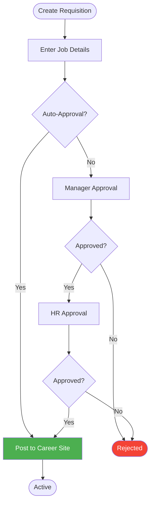
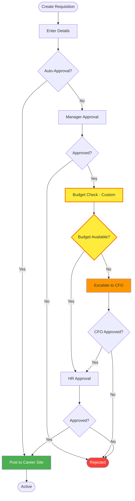
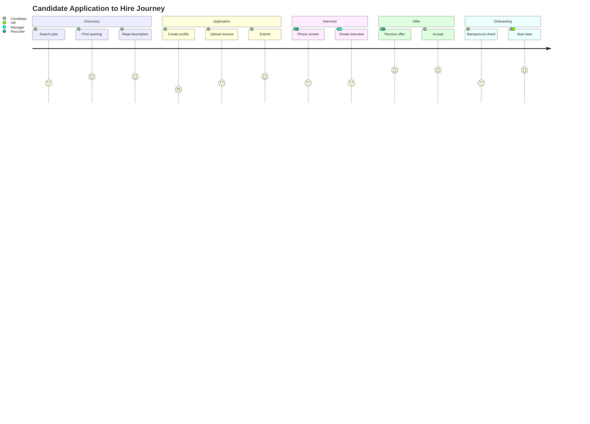
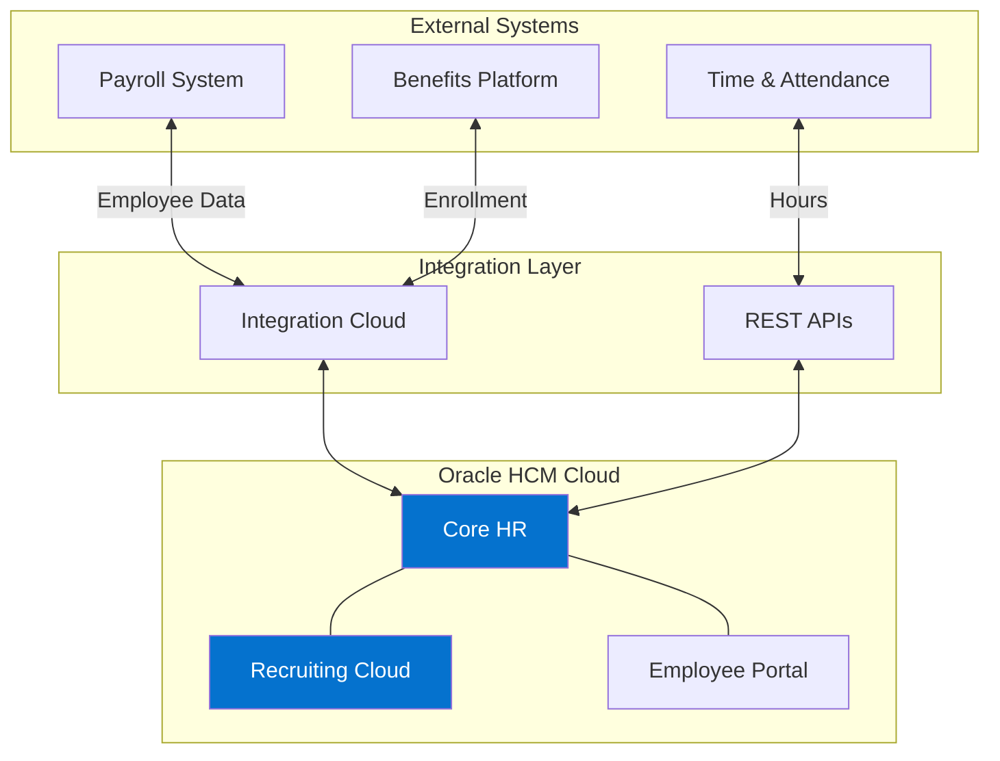
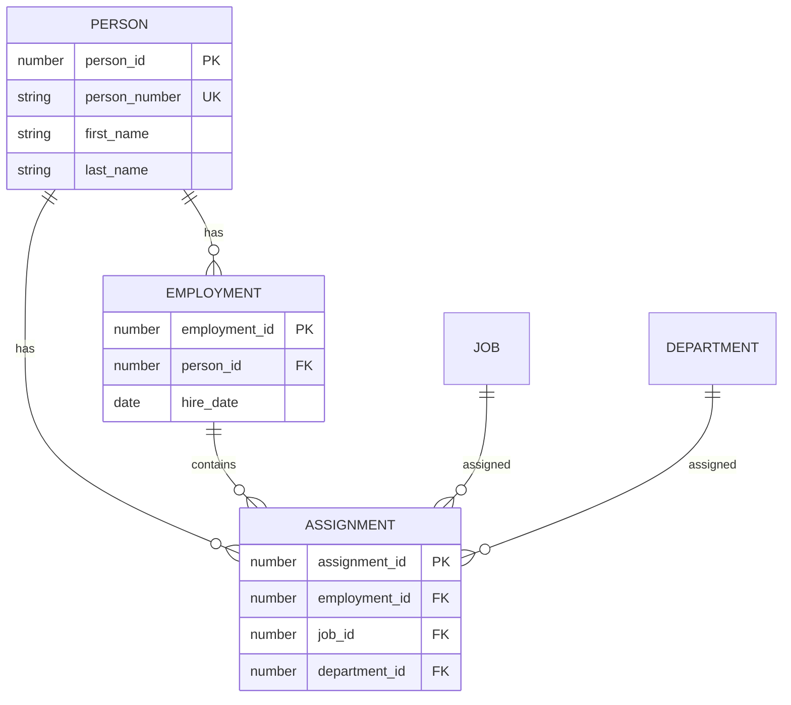

# Oracle HCM Quick Reference Guide

Complete reference for using the Oracle HCM Solution Architect skill.

## Table of Contents
1. [Mermaid Diagram Examples](#mermaid-diagram-examples)
2. [Oracle Terminology](#oracle-terminology)
3. [Communication Templates](#communication-templates)
4. [Best Practices](#best-practices)

---

## Mermaid Diagram Examples

### Example 1: Standard Requisition Approval Flowchart



### Example 2: Custom Requisition with Budget Check



### Example 3: Candidate Journey Map



### Example 4: Integration Architecture



### Example 5: Data Model (ER Diagram)



---

## Oracle Terminology

### Core HR Terms

| Term | Definition | Example |
|------|------------|---------|
| **Person** | Individual in system | John Smith (ID: 12345) |
| **Employment** | Legal employment relationship | Full-time with Creighton |
| **Assignment** | Work details (job, dept, location) | Accountant in Finance |
| **Legal Employer** | Entity that employs person | Creighton University |
| **Action** | HR transaction type | Hire, Promotion, Transfer |

### Recruiting Terms

| Term | Definition | Example |
|------|------------|---------|
| **Requisition** | Approved job opening | REQ-2024-1234 |
| **Candidate** | Person who applied | Jane Doe |
| **Application** | Candidate's submission | Application for Manager role |
| **Phase** | Major recruiting stage | Phone Screen, Interview, Offer |
| **State** | Status within phase | Scheduled, Completed, Passed |
| **CSP** | Candidate Selection Process | The workflow candidates follow |

### Security Terms

| Term | Definition | Example |
|------|------------|---------|
| **RBAC** | Role-Based Access Control | Who can do what |
| **Job Role** | Role based on job | Recruiter Job Role |
| **Duty Role** | Grouping of privileges | Maintain Worker Duty |
| **Data Security** | Controls data access | Can only see own dept |
| **Function Security** | Controls actions | Can create requisitions |

### Technical Terms

| Term | Definition | Example |
|------|------------|---------|
| **HDL** | HCM Data Loader (bulk import) | Load 1000 new hires |
| **HCM Extract** | Bulk data export | Extract payroll data |
| **OTBI** | Transactional Business Intelligence | Ad-hoc reports |
| **BIP** | Business Intelligence Publisher | Formatted PDF reports |
| **DFF** | Descriptive Flexfield (custom fields) | Badge number field |
| **EFF** | Extensible Flexfield (complex data) | Equipment tracking |
| **BPM** | Business Process Management | Custom workflows |
| **REST API** | Web services integration | Employee sync |

### Redwood UI Terms

| Term | Definition |
|------|------------|
| **Redwood** | Modern Oracle UI (replaces ADF) |
| **Card** | Content container component |
| **Tile** | Dashboard widget |
| **Dynamic Layout** | Responsive page design |

---

## Communication Templates

### For HR Staff: Process Guide Template

```markdown
# [Process Name] - User Guide

## What is this process?
[1-2 sentence explanation]

## When do I use this?
[Describe scenarios]

## Step-by-Step Instructions

### Step 1: [Action]
**What to do:**
1. [Action 1]
2. [Action 2]

💡 **Tips:** [Helpful information]

### Step 2: [Next Action]
[Continue...]

## Troubleshooting
**Problem**: [Issue]  
**Solution**: [Fix]

## Need Help?
Contact: [Support info]
```

### For Employees: Quick Reference

```markdown
# How to [Action] in Oracle

## Steps

### 1️⃣ [First Step]
[One sentence]

### 2️⃣ [Second Step]
[One sentence]

### 3️⃣ [Third Step]
[One sentence]

**Need help?** Call: [Phone] or Email: [Email]
```

### For Executives: Summary Template

```markdown
# [Initiative] - Executive Summary

## Overview
[2-3 sentences]

## Business Impact
- **Efficiency**: [Improvement]
- **Cost**: [Savings/Investment]
- **ROI**: [Payback period]

## Timeline
[Key dates]

## Investment
**Total**: $[Amount]

## Recommendation
[Clear recommendation]

## Next Steps
1. [Action with date]
2. [Action with date]
```

---

## Best Practices

### Color Standards

Always use these colors consistently:

- 🟢 **Green** (#4caf50): Success, approved, completed
- 🔴 **Red** (#f44336): Error, rejected, blocked
- 🟡 **Yellow** (#ffeb3b): **Customization**, warning
- 🟠 **Orange** (#ff9800): Escalation, high priority
- 🔵 **Blue** (#2196f3): Standard Oracle
- 🟣 **Purple** (#9c27b0): External system
- ⚪ **Gray** (#9e9e9e): Inactive, optional

### Customization Highlighting

**Always use this pattern:**
```mermaid
style CustomNode fill:#ffeb3b,stroke:#f57c00,stroke-width:3px
```

### Diagram Checklist

Before finalizing, verify:

**Content:**
- [ ] Title is clear
- [ ] Purpose stated
- [ ] Audience identified
- [ ] All steps in order
- [ ] Decision points clear
- [ ] Error paths shown
- [ ] Customizations highlighted

**Visual:**
- [ ] Layout clean
- [ ] Colors follow standards
- [ ] Labels descriptive
- [ ] Legend included
- [ ] Readable

**Technical:**
- [ ] Mermaid syntax valid
- [ ] Technical details accurate
- [ ] No sensitive data
- [ ] Version/date included

### Common Workflow Patterns

**Requisition Approval:**
1. Create → Auto-check → Approve (Manager → HR → Finance) → Post → Active

**Candidate Flow:**
1. Apply → Screen → Phone Screen → Interview → Offer → Hire → Onboard

**Employee Hire:**
1. Select candidate → Enter employment → Create assignment → Add personal info → Complete

### Security Best Practices

**Never include:**
- Real employee names (use "Employee A")
- Actual salaries (use "$75,000" as example)
- SSNs or personal data
- Real passwords or API keys

### Oracle-Specific Reminders

1. **Redwood is mobile-first** - Always consider mobile
2. **Date-effective data** - Never delete, date-end
3. **RBAC affects visibility** - Role determines what users see
4. **Quarterly updates** - Oracle updates every 3 months
5. **Customizations impact upgrades** - Document well

### Audience Adaptation

**Technical (IT):**
- Include API endpoints
- Show error handling
- Provide config details
- Reference Oracle docs

**HR Staff:**
- Simple language
- Step-by-step
- Screenshots
- Tips and tricks

**Employees:**
- Very simple
- Visual
- Quick reference
- Mobile-friendly

**Executives:**
- High-level only
- Business value
- ROI focus
- Risk assessment

---

## Quick Reference: Oracle Workflows

### Standard Requisition Approval
```
Create → Auto-check → 
  If auto-approved: Post
  If not: Manager → HR → Finance → Post
```

### Candidate Selection Process (CSP)
```
New → Screening → Phone Screen → Interview → Offer → Hire
```

### Integration Patterns
- **REST API**: Real-time, single records
- **HCM Extract**: Scheduled, large volumes
- **HDL**: Bulk loads, as needed
- **OIC**: Complex orchestration

---

## Tips for Success

1. **Always clarify audience first** - Determines technical depth
2. **Highlight customizations** - Yellow with thick border
3. **Show error paths** - Not just happy path
4. **Use Oracle terms correctly** - See terminology above
5. **Consider mobile** - Redwood is mobile-first
6. **Version everything** - Date and version number
7. **Test with users** - Validate before finalizing
8. **Respect privacy** - No real employee data

---

## Common Use Cases

### "Document our workflow"
**Ask:** Standard or custom? Current or future state?  
**Create:** Flowchart with yellow highlighting for customizations  
**Output:** Mermaid diagram + documentation

### "Create training"
**Ask:** Audience experience level?  
**Create:** Simple flowcharts + step-by-step guide  
**Output:** Complete training package

### "Show architecture"
**Ask:** Technical or executive audience?  
**Create:** Architecture diagram with integrations  
**Output:** Diagram + narrative

### "Make presentation"
**Ask:** Which process? Key message?  
**Create:** Multiple diagrams for slides  
**Output:** PowerPoint (via pptx skill)

---

**For more details, see SKILL.md**

Version 1.0 | November 2024 | Creighton University
